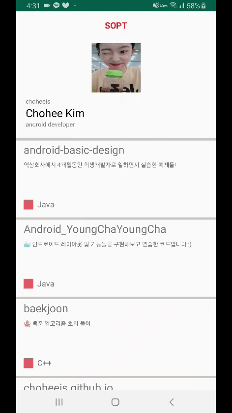

# 🌷 초희 표 Android 개발 라이브러리 🌷

> 난 진짜 안드로이드 장인이 되어야겠다! 안되겠다!!!! 그 날까지 영차영차!!!!

 

## ❤️ ThisisRecyclerView

--> [리사이클러뷰 만드는 라이브러리](https://github.com/choheeis/Android_YoungChaYoungCha/blob/master/%EB%A6%AC%EB%93%9C%EB%AF%B8%EB%AA%A8%EC%9D%8C%EC%A7%91/ThisisRecyclerView%EC%97%90%20%EB%8C%80%ED%95%9C%20%EB%A6%AC%EB%93%9C%EB%AF%B8~.md)

 

## 🧡 ThisisRetrofit

--> [Retrofit라이브러리를 사용하여 서버와 RESTful 통신하는 라이브러리](https://github.com/choheeis/Android_YoungChaYoungCha/blob/master/%EB%A6%AC%EB%93%9C%EB%AF%B8%EB%AA%A8%EC%9D%8C%EC%A7%91/ThisisRetrofit%EC%97%90%20%EB%8C%80%ED%95%9C%20%EB%A6%AC%EB%93%9C%EB%AF%B8!.md)

 

## 💛 ViewPager

--> [ViewPager 만드는 라이브러리](https://choheeis.github.io/%EC%95%88%EB%93%9C%EB%A1%9C%EC%9D%B4%EB%93%9C/2020/03/01/ViewPager.html)

 

## 💚 Bottom Navigation

--> [Bottom Navigation 만드는 나만의 라이브러리](https://choheeis.github.io/%EC%95%88%EB%93%9C%EB%A1%9C%EC%9D%B4%EB%93%9C/2020/03/01/BottomNavigation.html)

 

## 💙 Bottom Navigation과 ViewPager 연결하여 슬라이드되는 Bottom Navigation Bar 만들기

--> [슬라이드되는 Bottom Navigation Bar 만드는 라이브러리](https://choheeis.github.io/%EC%95%88%EB%93%9C%EB%A1%9C%EC%9D%B4%EB%93%9C/2020/03/01/BottomNavigationSwipe.html)

 

