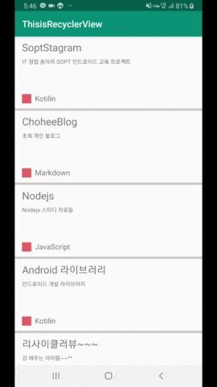

# 🌷 초희 표 Android 개발 라이브러리 🌷

> 난 진짜 안드로이드 장인이 되어야겠다! 안되겠다!!!! 그 날까지 영차영차!!!!

 

## ThisisRecyclerView

💁 리사이클러뷰 만드는 라이브러리

💁 리드미 --> [여기](https://github.com/choheeis/Android_YoungChaYoungCha/blob/master/%EB%A6%AC%EB%93%9C%EB%AF%B8Collection/ThisisRecyclerView%EC%97%90%20%EB%8C%80%ED%95%9C%20%EB%A6%AC%EB%93%9C%EB%AF%B8~.md)

 

## WebView

💁 06/25 코틀린으로 간단한 웹뷰를 띄워보는 프로젝트 ( 블로그 사이트를 띄웠다. )

 

## FirebaseInit

💁 07/09 ~ Firebase 프로젝트와 안드로이드 프로젝트를 연동시켜보는 프로젝트("Firebase로 안드로이드 SNS 앱 만들기(하울)" 책 참고)

Firebase에 대해서 간단하게 알아보려면 [여기](https://choheeis.github.io/firebase/2019/07/09/firebase.html)를 보면 도움이 된다!

 

- __1. 시작하기__

    안드로이드 스튜디오를 통해 새 프로젝트를 생성한다.

    (프로젝트 이름을 FirebaseInit 으로 설정하였다.)

     

- __2. 파이어베이스 홈페이지 접속하기__

    파이어베이스를 사용해야 하므로 공식 홈페이지에 들어가본다.

    공식 홈페이지 정중앙에 시작하기 버튼이 있으므로 클릭하였더니 [Firebase콘솔](https://console.firebase.google.com/) 사이트로 접속되었다.

    바로 보이는 프로젝트 추가 버튼을 클릭한 후, 프로젝트 이름란에 FirebaseInit을 적고, 애널리틱스 위치를 대한민국으로 바꾼 후, 프로젝트 만들기를 클릭하였다.

     

- __3. Android 앱에 Firebase 추가하기__

    프로젝트 만들기를 클릭하면 아래와 같은 FirebaseInit 프로젝트 콘솔 사이트로 연결된다.

    

    화면 중앙에 __앱에 Firebase를 추가하여 시작하기__ 문구가 보이고, 안드로이드 버튼을 클릭했다.

    그랬더니, 앱 등록을 위해 정보를 입력해야 하는 창이 보여졌고, 앱 닉네임과 디버그 서명 인증서라는 란은 선택사항이므로 Android 패키지 이름만 작성하였다.
    
    Android 패키지 이름은 1번에서 생성한 프로젝트의 패키지 이름을 작성하였다.

    구성 파일을 다운로드하고, Android 프로젝트 폴더에 추가하는 방법이 친절하게 설명되어 있는 창이 떠서 그대로 따라하였다.

    그 다음, Firebase SDK를 안드로이드 스튜디오에 추가하는 방법이 나와서 이것도 그대로 따라하였다.

    여기까지 하면 앱이 Google 서버와 통신했는지 확인하는 작업을 거쳐 (오래걸린다..? 5분 정도 기다리다가 그냥 이 단계 건너뛰기를 눌렀다.) 안드로이드 프로젝트와 연동이 된다!
    
     

- __4. 오류 해결하기__

    3번까지 했더니 오류가 떴다.. 구글링을 엄청 해서 [여기](https://developer.android.com/jetpack/androidx/migrate) 라는 사이트에 나와있는대로 두 가지 속성을 true로 추가해줬더니 해결되었다!
    
     

    > 여기까지 해서 안드로이드 프로젝트과 Firebase를 연동시키는 작업을 끝냈다!
    
     

## FlutterCodelab

💁 07/27 GDG Campus Korea에서 주최한 Try! Flutter세미나에 참가하여 실습해본 Flutter 코드랩 프로젝트

[코드랩1](https://codelabs.developers.google.com/codelabs/first-flutter-app-pt1/index.html?index=..%2F..index#1) 과 [코드랩2](https://codelabs.developers.google.com/codelabs/first-flutter-app-pt2/index.html?index=..%2F..index#0) 을 따라해보았다.

 

## FacebookLogin

💁 08/15 ~ [여기]()를 통해 이 프로젝트의 대략적인 개요를 확인할 수 있다!

[FirebaseUI 인증](https://firebase.google.com/docs/auth/android/firebaseui?authuser=0) 을 참고하여 하라는대로 똑같이 하면 된다!

더 자세한 내용은 [깃허브](https://github.com/firebase/FirebaseUI-Android/blob/master/auth/README.md) 를 참고하자!

__오류 및 띠용~? 해결하기__

1. __띠용 1__

    "프로젝트 수준 build.gradle 파일의 buildscript 및 allprojects 섹션에 Google Maven 저장소가 포함되어 있어야 한다"

    라는 말이 쓰여 있었는데 Google Maven 이라는 것을 잘 모르지만 예전에 개발할 당시 많이 보았던 코드이기에 "구글 메이븐 추가하기" 라고 검색하여 나온 [여기](http://sjava.net/2017/06/%EC%95%88%EB%93%9C%EB%A1%9C%EC%9D%B4%EB%93%9C-%EC%A7%80%EC%9B%90-%EB%9D%BC%EC%9D%B4%EB%B8%8C%EB%9F%AC%EB%A6%AC-%EA%B5%AC%EA%B8%80-%EB%A9%94%EC%9D%B4%EB%B8%90-%EB%A6%AC%ED%8C%8C%EC%A7%80/) 를 참고하여 추가하였다.

    > 구글 메이븐이 무엇인지도 찾아봐야 겠다!!

     

2. __띠용 2__

    

    라는 라이브러리를 추가해야 했었다! 그런데 주석을 잘 읽어보지 않아서 버전을 4.x 그대로 써서 오류가 났었다. 

    주석을 보니 최신 SDK 버전을 찾아서 그 버전으로 작성하라는 내용이 있었는데 주석을 확인하지 않으니 이런 실수가 생겼다!!

    다음번에는 주석도 꼼꼼히 보자~^^^^^^

     
 
3. __띠용 3__

    

    위와 같은 4단계를 따라하다가 아래와 같은 띠용이 발생하였다.

    

    이 부분에서 설정을 완료하려면 OAuth 리디렉션 URI를 Facebook 앱 구성에 추가하라고 되어있는데 그래서 대체 이걸 어떻게 추가하라는 건지 모르겠었다! 

    4단계를 다시 잘 읽어보니 "일부 로그인 방법은 추가 정보가 필요하며 해당 서비스의 개발자 콘솔에서 확인할 수 있다" 라는 말을 보고 페이스북 개발자 콘솔이라고 구글링해보았다.

    그랬더니 페이스북 개발자 사이트가 나왔고, 여기서 앱을 만들 수 있었다!

    > 앱을 만들어야 하는건지 고민했었는데 위 그림에서 URL을 페이스북 앱 구성에 추가하라고 했으니 일단 페이스북 앱이 있어야 하는구나 라고 생각했다,,!

    그리고 나서 페이스북 로그인 설정이라는 배너를 찾았고, 그 곳에 드디어 '유효한 OAuth 리디렉션 URL' 이라는 칸이 있었다! (아래그림 참고)

    

     

4. __오류 1__

    

    이 코드를 추가할 때 , onActivityResult 함수 호출 시 requestCode로 받는 RC_SIGN_IN 이라는 변수가 존재하지 않는다는 오류가 발생했다. 

    분명, [FirebaseUI 인증](https://firebase.google.com/docs/auth/android/firebaseui?authuser=0) 사이트에 나와있는대로 똑같이 따라하면 RC_SIGN_IN 이라는 변수가 정의되어 있지 않다. 

    그래서 FirebaseUIActivity.kt 의 전체 소스를 보니 맨 밑에 

    ~~~kotlin
    companion object{
        private const val RC_SIGN_IN = 123
    }
    ~~~

    라는 코드가 있었다! 그래서 내 프로젝트에도 이 코드를 추가해주었더니 오류가 해결되었다.

    > 그런데 companion object 라는 함수(?)가 뭔지 모르겠다! 찾아봐야지!

     

5. __오류 2__

    빌드를 시키니 
    
    ~~~
    java.lang.IllegalStateException: Default FirebaseApp is not initialized in this process com.example.facebooklogin. Make sure to call FirebaseApp.initializeApp(Context) first.
    ~~~

    라는 오류가 등장했다,, 오류를 해석해보니 내 프로젝트가 파이어베이스의 기본 앱으로 지정이 안되어 있으니, FirebaseApp.initializeApp(Context)를 호출하라는 것이였다.

    그래서 mainActivity 파일에 

    ~~~kotilin
     FirebaseApp.initializeApp(this)
    ~~~

    을 추가하고 다시 빌드를 시켰다.

    그런데 그래도 똑같은 오류가 사라지지 않았고, 결국 구글링을 하여 [여기](https://stackoverflow.com/questions/40081539/default-firebaseapp-is-not-initialized) 사이트를 참고하여 몇 코드를 추가했더니 오류를 해결할 수 있었다!

    > 여기까지 다 해서 빌드까지 성공시켰는데 ㅋㅋㅋㅋ 음~~ 무슨 페이스북 마크 하나가 띡 생겼다가 사라지는데? ㅋㅋㅋㅋㅋㅋㅋㅋㅋㅋ 흐음~~~~

